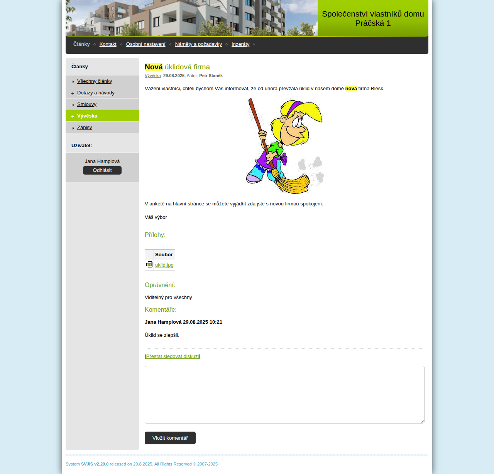
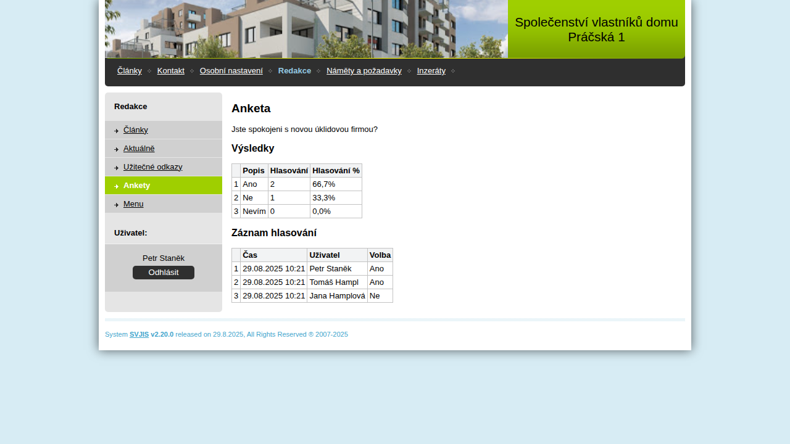
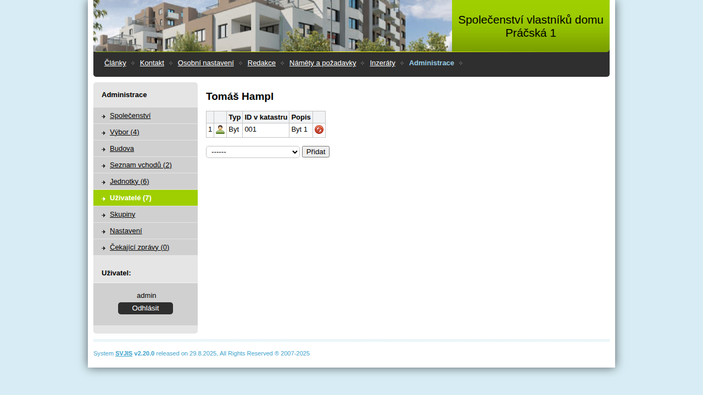
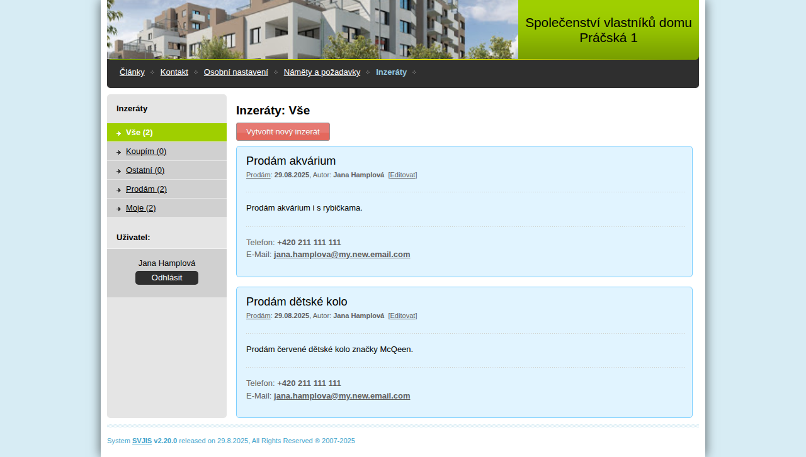

# Vlastnosti a funkce systému

## Přístupová práva

* flexibilní systém přístupových práv k článkům a dalším funkcím systému (články mohou být viditelné pro všechny, jen pro členy výboru, nebo jen pro určitou skupinu uživatelů)
* možnost trvalého přihlášení uživatele (uživatel vidí všechny články podle svého oprávnění bez nutnosti opětovného zadávání přihlašovacích údajů při každé návštěvě webu)

## Redakční systém

* fulltextové vyhledávání v článcích

* možnost povolení diskuzí pod článkem

* kategorizace článků podle oblastí (smlouvy, zápisy, ...)

* krátké novinky na hlavní stránce

## Hromadné rozesílání e-mailových upozornění

* možnost upozorňování na nové články

## Ankety

* hlasování podle počtu hlasujících - výsledkem je jmenný seznam hlasujících a jejích hlasování

## Hlášení a sledování závad

* umožňuje vlastníkům nahlásit závadu na domě
* sledovat aktuální seznam závad a jejich řešení
* diskuze v tiketu závady

## Databáze vlastníků a kontaktů

* každý vlastník má své "osobní nastavení" kde si udržuje aktuální kontaktní údaje

## Databáze jednotek a jejich podílů

* možnost evidovat seznam jednotek a jejich vlastníků

## Inzeráty

* uživatelé mohou vystavovat soukromé inzeráty typu prodám, koupím ...

## Plnohodnotná mobilní verze

V dnešní době už většina uživatelů používá pro přístup k internetu mobilní telefon, takže je tu i plnohodnotná mobilní verze.

