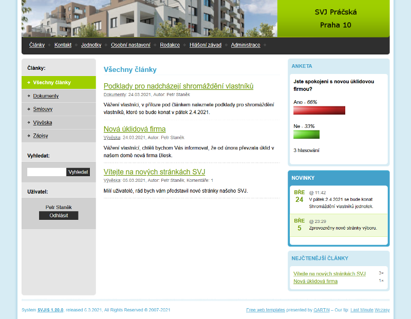

# SVJIS - Webový systém pro SVJ

SVJIS je open source CMS (Content management system) vyvíjený pro potřeby SVJ tak, aby zjednodušil komunikaci mezi vlastníky a výborem, umožňoval nahlašovat závady a pomáhal udržovat aktuální evidenci vlastníků a jednotek.

* [Vlastnosti systému](Vlastnosti.md)
* [Instalace systému](Instalace.md)
* [Parametrizace](Parametrizace.md)
* [Často kladené dotazy](FAQ.md)
* [Kontakt](Kontakt.md)

Hashtags: 
#WebSvj 
{: .label .label-yellow }

#FreeSVJ 
{: .label .label-yellow }

#OpenSVJ
{: .label .label-yellow }