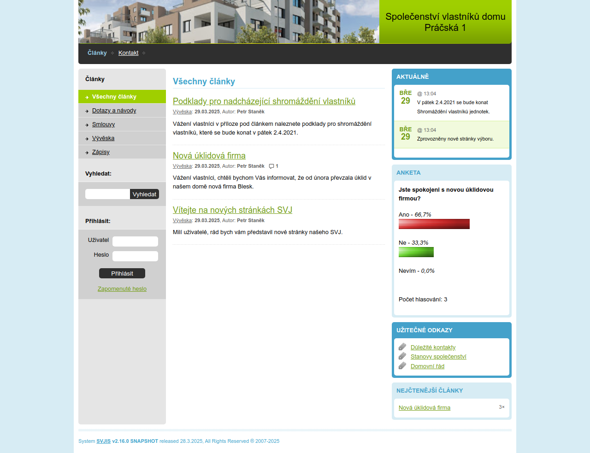

# SVJIS - Webový systém pro SVJ nebo BD

SVJIS je open source a free CMS (Content management system) vyvíjený pro potřeby SVJ nebo BD tak, aby zjednodušil komunikaci mezi vlastníky a výborem, umožňoval nahlašovat závady a pomáhal udržovat aktuální evidenci vlastníků a jednotek.

{: .highlight }
Systém je 100% free - je bez reklam, kdokoliv ho může používat zdarma, dále ho šířit nebo upravovat. Všechna data zůstávají jen a pouze u vás.

* [Vlastnosti systému](Vlastnosti.md)
* [Spuštění](Spusteni.md)
* [Instalace systému](Instalace.md)
* [Parametrizace](Parametrizace.md)
* [Návody](HowTo.md)
* [Často kladené dotazy](FAQ.md)
* [Kontakt](Kontakt.md)
 
#WebSvj 
{: .label .label-yellow }

#OpenSVJ
{: .label .label-yellow }

#FreeSVJ 
{: .label .label-yellow }

#FreeSVJWeb 
{: .label .label-yellow }
